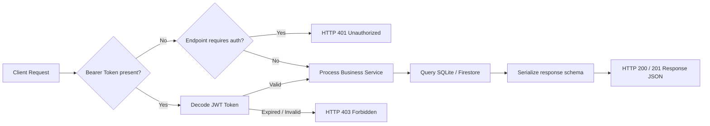

# OrbitX API Reference Guide

This reference details the REST API endpoints exposed by the OrbitX Python FastAPI backend.

---

## 1. Authentication Endpoints

### A. User Authentication Login
- **Endpoint**: `/api/v1/auth/login`
- **Method**: `POST`
- **Authentication Required**: No
- **Request Body (form-data or JSON)**:
  ```json
  {
    "username": "commander@orbitx.com",
    "password": "securepassword123"
  }
  ```
- **Success Response (HTTP 200)**:
  ```json
  {
    "access_token": "eyJhbGciOiJIUzI1NiIsInR5cCI6IkpXVCJ9...",
    "token_type": "bearer"
  }
  ```
- **Error Response (HTTP 401)**:
  ```json
  {
    "detail": "Incorrect username or password"
  }
  ```

### B. Retrieve Active Profile
- **Endpoint**: `/api/v1/auth/me`
- **Method**: `GET`
- **Authentication Required**: Yes (Bearer Token)
- **Success Response (HTTP 200)**:
  ```json
  {
    "id": 101,
    "email": "commander@orbitx.com",
    "name": "Commander Reddy",
    "role": "Mission Controller"
  }
  ```

---

## 2. Satellite & Telemetry Endpoints

### A. List Active Satellites
- **Endpoint**: `/api/v1/tracking/satellites`
- **Method**: `GET`
- **Authentication Required**: No
- **Query Parameters**:
  - `limit` (int, default: 20): Maximum records returned.
  - `skip` (int, default: 0): Pagination offset.
- **Success Response (HTTP 200)**:
  ```json
  [
    {
      "id": "SAT-ORBIT-1A",
      "name": "ISS Tracker-1",
      "latitude": 45.1023,
      "longitude": -120.4851,
      "altitude_km": 420.5,
      "velocity_kmh": 27600
    }
  ]
  ```

### B. Single Satellite Telemetry Details
- **Endpoint**: `/api/v1/tracking/satellites/{satellite_id}`
- **Method**: `GET`
- **Authentication Required**: No
- **Path Parameters**:
  - `satellite_id` (string): Unique identifier for target satellite.
- **Success Response (HTTP 200)**:
  ```json
  {
    "id": "SAT-ORBIT-1A",
    "name": "ISS Tracker-1",
    "latitude": 45.1023,
    "longitude": -120.4851,
    "altitude_km": 420.5,
    "velocity_kmh": 27600
  }
  ```

---

## 3. Mission Notes Endpoints

### A. List User Notes
- **Endpoint**: `/api/v1/notes`
- **Method**: `GET`
- **Authentication Required**: Yes (Bearer Token)
- **Success Response (HTTP 200)**:
  ```json
  [
    {
      "id": 4,
      "title": "Jupiter Atmosphere",
      "content": "Approximately 75% hydrogen and 24% helium.",
      "updated_at": "2026-07-20T09:00:00Z"
    }
  ]
  ```

### B. Create Note
- **Endpoint**: `/api/v1/notes`
- **Method**: `POST`
- **Authentication Required**: Yes (Bearer Token)
- **Request Body (JSON)**:
  ```json
  {
    "title": "Jupiter Atmosphere",
    "content": "Approximately 75% hydrogen and 24% helium."
  }
  ```
- **Success Response (HTTP 201)**:
  ```json
  {
    "id": 4,
    "title": "Jupiter Atmosphere",
    "content": "Approximately 75% hydrogen and 24% helium.",
    "created_at": "2026-07-20T09:12:00Z"
  }
  ```

---

## 4. API Request Lifecycle Flow


