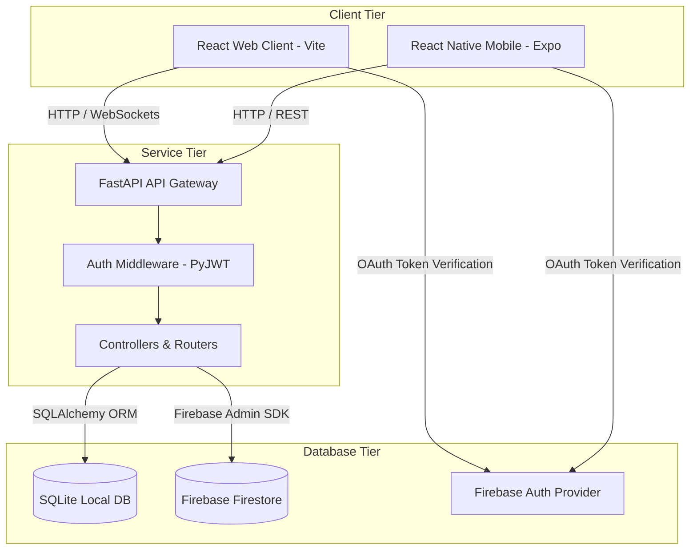
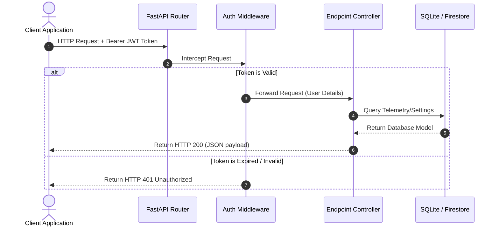

# OrbitX System Architecture

This document describes the high-level structure of the OrbitX application, mapping components, data flow interactions, and runtime dependencies.

---

## 1. High-Level Architecture

OrbitX uses a **decoupled three-tier architecture** comprising React/React Native clients, a Python FastAPI backend, and SQL/Firebase databases.

---

## 2. Component Descriptions

### A. Client Tier
- **React Web Application**: Served by Vite, provides the main desktop dashboard, interactive WebGL 3D views, and chat channels.
- **React Native Mobile App**: Expo-based app replicating satellite mapping, chats, and note-taking interfaces for mobile devices.

### B. Service Tier (FastAPI Gateway)
- **Routers**: Map HTTP endpoints to controllers.
- **Middleware**: Intercepts requests, validates JWT tokens, manages CORS, and logs transactions.
- **Services/Controllers**: Process core business logic (e.g. computing satellite trajectories, parsing database records).

### C. Database Tier
- **SQLite**: Local relational database handling migrations via Alembic for structured records (user data, local settings).
- **Firebase Firestore**: Dynamic real-time database hosting real-time tracking streams and Chat messages.
- **Firebase Auth**: Manages credentials and JWT token sign-ons.

---

## 3. Request/Response Lifecycle

The request/response lifecycle for authenticated resources follows these steps:

