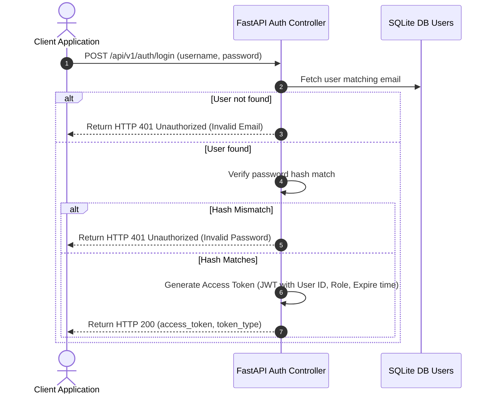

# OrbitX Authentication & Authorization

OrbitX employs token-based security using **JSON Web Tokens (JWT)**. Access is restricted using secure headers and role verification gates.

---

## 1. Authentication Login Flow



---

## 2. JWT Configuration & Token Structure

Tokens are signed on the server using `HS256` hashing with a secure, secret sign key.

### Token Claims Structure
```json
{
  "sub": "101",
  "name": "Reddy RaghuVardhan",
  "role": "Mission Controller",
  "exp": 1787342800
}
```
- **`sub`**: Subject claim containing the unique User ID.
- **`role`**: Authorization role used by route guards.
- **`exp`**: Expiration epoch timestamp (Default: 24-hour lifetime).

---

## 3. Route Guard & Authorization Gating

Endpoints requiring authorization (such as notes modification or settings updates) utilize FastAPI dependency injection:

```python
from fastapi import Depends, HTTPException, status
from fastapi.security import OAuth2PasswordBearer
from jose import jwt

oauth2_scheme = OAuth2PasswordBearer(tokenUrl="api/v1/auth/login")

def get_current_user(token: str = Depends(oauth2_scheme)):
    try:
        payload = jwt.decode(token, SECRET_KEY, algorithms=[ALGORITHM])
        user_id: str = payload.get("sub")
        user_role: str = payload.get("role")
        if user_id is None:
            raise HTTPException(status_code=401, detail="Invalid credentials")
        return {"id": user_id, "role": user_role}
    except jwt.JWTError:
        raise HTTPException(status_code=401, detail="Token has expired or is corrupt")
```
- Clients must include the header: `Authorization: Bearer <access_token>`
- If token validation fails, the middleware aborts the request immediately returning `HTTP 401 Unauthorized`.
