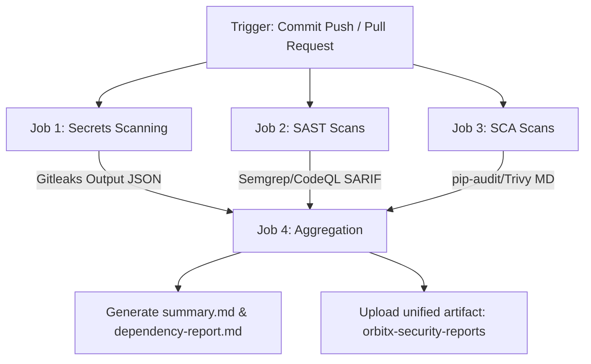

# OrbitX CI/CD Pipeline Guide

OrbitX integrates automated security and code quality checks into the software supply chain using GitHub Actions.

---

## 1. DevSecOps Workflow Pipeline Flow

The workflow is structured into four sequential jobs executing in parallel where possible:

---

## 2. Integrated Scans & Tools

- **Secrets Audit (Gitleaks)**: Scans history and code context for exposed private tokens or passwords, using custom rule files (`.gitleaks.toml`).
- **Code Quality SAST (Semgrep & CodeQL)**: Inspects source code syntax and semantics to identify vulnerabilities and code smells.
- **Software Composition SCA (Trivy, pip-audit, npm audit)**: Evaluates third-party library dependencies (Python and Node.js) for known CVEs.
- **License Auditor (Trivy)**: Audits dependencies packages for restrictive license categories (e.g. GPL-3.0) to ensure compliance.

---

## 3. Reporting and Gates

On workflow completion, security reports are compiled into a unified artifact called `orbitx-security-reports`:
- **`summary.md`**: Provides a quick scorecard showing counts of findings.
- **`dependency-report.md`**: Aggregates all python/node.js outdated package findings.
- **SARIF reports**: Can be loaded under the **Security** tab of the GitHub repository.
