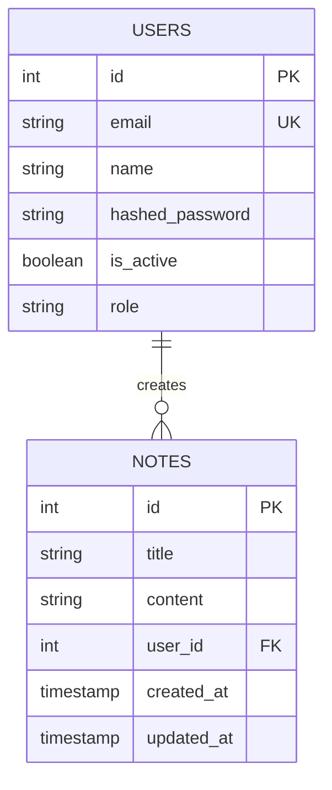

# OrbitX Database Design

OrbitX utilizes a dual database strategy: a relational SQLite database for local configurations, accounts, and notes management (structured schemas), and a Firebase Firestore database for real-time telemetry streams.

---

## 1. SQL Database Schema & Entities

The SQLite database structure managed by SQLAlchemy ORM and Alembic migrations includes the following entities:

### A. `users` Table
Stores user account profiles and credentials.

| Column | Type | Constraints | Description |
|---|---|---|---|
| `id` | INTEGER | PRIMARY KEY, AUTOINCREMENT | Unique record key. |
| `email` | VARCHAR(255) | UNIQUE, INDEX, NOT NULL | Account login email. |
| `name` | VARCHAR(255) | NOT NULL | User's full name. |
| `hashed_password` | VARCHAR(255) | NOT NULL | Hashed representation of password. |
| `is_active` | BOOLEAN | DEFAULT TRUE | Account operational status flag. |
| `role` | VARCHAR(50) | DEFAULT 'Astronaut' | Authorization level role. |

### B. `notes` Table
Stores space mission notes created by users.

| Column | Type | Constraints | Description |
|---|---|---|---|
| `id` | INTEGER | PRIMARY KEY, AUTOINCREMENT | Unique note key. |
| `title` | VARCHAR(255) | INDEX, NOT NULL | Title of the note. |
| `content` | TEXT | NOT NULL | Content payload of the note. |
| `user_id` | INTEGER | FOREIGN KEY (`users.id`) | Creator reference identifier. |
| `created_at` | TIMESTAMP | DEFAULT CURRENT_TIMESTAMP | Timestamp when created. |
| `updated_at` | TIMESTAMP | DEFAULT CURRENT_TIMESTAMP | Timestamp when modified. |

---

## 2. Conceptual Database Entity Relationship Diagram

---

## 3. Real-Time Telemetry Data Structure (Firestore)

Real-time satellite coordinates and communication chat boards are housed under non-relational Firebase Firestore collections:

### Collection: `satellite_telemetry`
- **Document ID**: `satellite_id`
- **Attributes**:
  - `name`: string
  - `latitude`: float
  - `longitude`: float
  - `altitude_km`: float
  - `velocity_kmh`: float
  - `updated_at`: timestamp

### Collection: `chat_channels`
- **Document ID**: `channel_name`
  - **Subcollection**: `messages`
    - `id`: string (auto-gen)
    - `sender`: string
    - `text`: string
    - `timestamp`: timestamp
