# OrbitX Frontend Design

The OrbitX client application is built as a responsive, real-time web interface using React, Vite, and HTML5 Canvas (WebGL).

---

## 1. Web Application Component Structure

The frontend code under `orbitx-web/` is organized as follows:

```
orbitx-web/
├── public/                 # Static asset files (icons, fallback images)
├── src/
│   ├── assets/             # Shared styling files and logos
│   ├── components/         # Interactive UI Dashboard modules
│   │   ├── LiveTracker.jsx # Real-time satellite radar telemetry maps
│   │   ├── LaunchHub.jsx   # Launch pad information and rocket lists
│   │   ├── SpaceNotesAI.jsx# notes searches and flashcards HUDs
│   │   ├── SolarSystem.jsx # 3D simulation canvas
│   │   ├── SpaceChat.jsx   # Team chat channel logs
│   │   └── Settings.jsx    # User configuration inputs
│   │
│   ├── firebase/           # Database connections and configs
│   │   └── config.js
│   │
│   ├── App.jsx             # Shell wrapper routing active components
│   ├── main.jsx            # Entry mount controller
│   └── index.css           # Global theme colors and style sheets
```

---

## 2. Navigation Architecture

OrbitX uses a cross-window **Sidebar Bridge** setup. When a user clicks navigation menu links, the React component maps state keys to render the target modules without refreshing the page.

```mermaid
graph TD
    A[Sidebar Shell] --> B[Satellite Radar Module]
    A --> C[Launch Hub Cockpit]
    A --> D[3D Solar System View]
    A --> E[Space Notes AI Screen]
    A --> F[Chat Workspace]
    A --> G[Settings Panel]
    
    style A fill:#0c1424,stroke:#00e5ff,stroke-width:2px;
```



### Module Descriptions
1. **Live Tracker (`LiveTracker.jsx`)**: Renders a Mercator projection map overlaid with satellite icons, updating position coordinates dynamically via WebSockets.
2. **Launch Hub (`LaunchHub.jsx`)**: Displays details on active space launches, including rocket stages status, payload weights, and live timers.
3. **Space Notes AI (`SpaceNotesAI.jsx`)**: Provides search tools linking to historical astronomic libraries. If external APIs fail, it falls back to local SQLite data caches.
4. **Solar System Simulator (`SolarSystem.jsx`)**: Employs WebGL to render planets rotating along their orbital lines.
5. **Space Chat (`SpaceChat.jsx`)**: Pulls real-time messages from Firebase Firestore.
