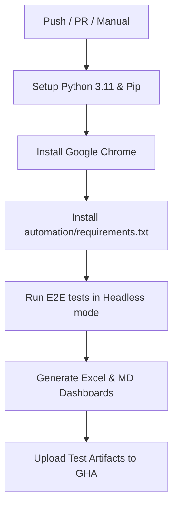

# GitHub Actions CI/CD Pipeline Configuration Guide

This document describes how to configure the OrbitX E2E test suite inside GitHub Actions.

---

## Workflow Overview

The E2E pipeline is configured at `.github/workflows/selenium-e2e.yml`. It runs automatically inside cloud containers, setting up Chrome and Python dynamically.

---

## Action Triggers

- **Push**: Runs on commits merged into `main` or `master`.
- **Pull Request**: Validates new branches targetting `main` or `master`.
- **Manual dispatch**: Triggerable from the GitHub repository actions tab.

---

## GitHub Secrets Setup

To run tests against secure endpoints, you must define environment variables as repository Secrets. Go to your repository settings at **Settings > Secrets and variables > Actions** and create:

| Secret Name | Description | Default / Example Value |
| :--- | :--- | :--- |
| `BASE_URL` | The domain URL of the deployed OrbitX app. If left empty, tests will spin up a local mock web server. | `https://staging.orbitx-app.com` |
| `USERNAME` | Authentication account email to pass validation test cases. | `astronaut@orbitx.com` |
| `PASSWORD` | Security password associated with the username secret. | `spacepassword123` |

---

## Report Artifacts Uploads

If any test cases fail, the pipeline ensures that report compilation steps run. All output files are archived under the artifact package named `test-reports-and-results`:
- `report.html` (Standalone pytest interface)
- `test-results.xlsx` (4-sheet Excel summary)
- `summary.md`
- `executive-summary.md`
- `failed-tests.md`
- `screenshots/` (All PNG capture failures)
