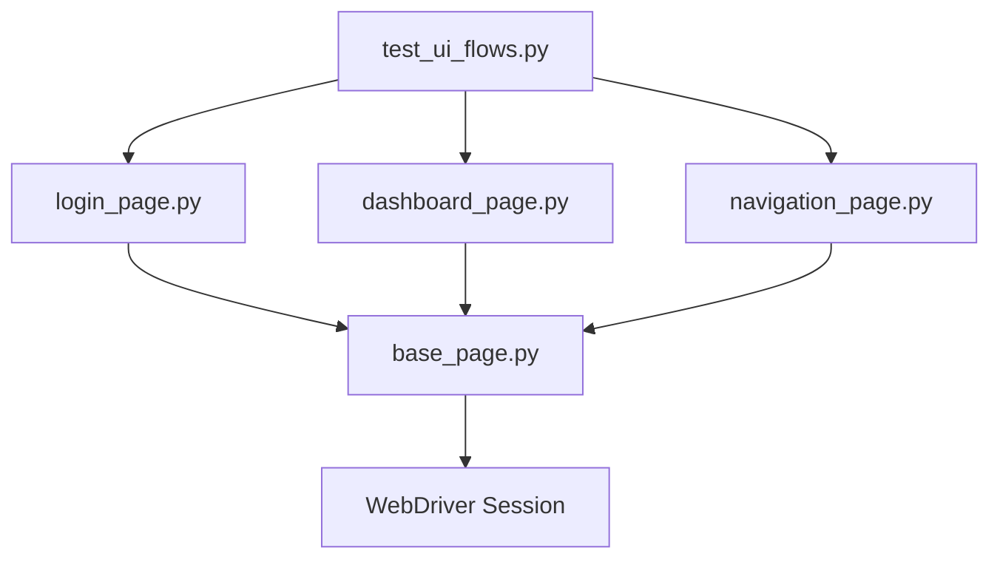

# Selenium E2E Automation Framework Architecture

This document describes the Page Object Model (POM) architecture, components, and assertion logic implemented in the OrbitX E2E validation framework.

---

## Page Object Model (POM) Design

The framework splits tests (which state *what* to verify) from the web pages (which encapsulate *how* to interact with the DOM elements).

### Page Class Inventories

1. **`BasePage` (`pages/base_page.py`)**
   - **Purpose**: Wraps raw Selenium interactions with explicit wait conditions (`WebDriverWait`).
   - **Key APIs**:
     - `navigate_to(path)`: Navigates using base URL configurations.
     - `find_element(locator, timeout)`: Explicit wait for element visibility.
     - `click(locator)`: Waits for visibility and triggers click.
     - `type(locator, text)`: Safely clears fields and inputs strings.
     - `is_visible(locator)`: Non-blocking visibility boolean check.
2. **`LoginPage` (`pages/login_page.py`)**
   - **Locators**:
     - Username: `ID = "username"`
     - Password: `ID = "password"`
     - Submit Button: `ID = "login-btn"`
     - General Error Label: `ID = "general-error"`
   - **Core Flow**: `login(username, password)` types credentials and submits.
3. **`DashboardPage` (`pages/dashboard_page.py`)**
   - **Locators**:
     - Profile Label: `ID = "profile-name"`
     - Header Title: `ID = "content-title"`
     - Logout Button: `ID = "logout-btn"`
   - **Core Flow**: Fetches profiles strings and handles session logouts.
4. **`NavigationPage` (`pages/navigation_page.py`)**
   - **Locators**: Tab buttons (`ID = "nav-space-notes"`, `"nav-satellite-radar"`, etc.)
   - **Core Flow**: Navigates workspace sidebar menus and verifies `.active` CSS style states.

---

## Failure Screenshots and Reporting Lifecycle

- **Screenshot Capture**: Managed in `conftest.py` inside the `pytest_runtest_makereport` hook. If a test fail assertion during the `call` phase, the runner takes a PNG screenshot and stores it in `reports/screenshots/{test_name}.png`.
- **Extended Test Reporting**:
  - Automatically runs inside `pytest_sessionfinish`.
  - Aggregates runtime data and calls the `ExtendedReporter` utility to build the Excel spreadsheets and Markdown summary reports.
