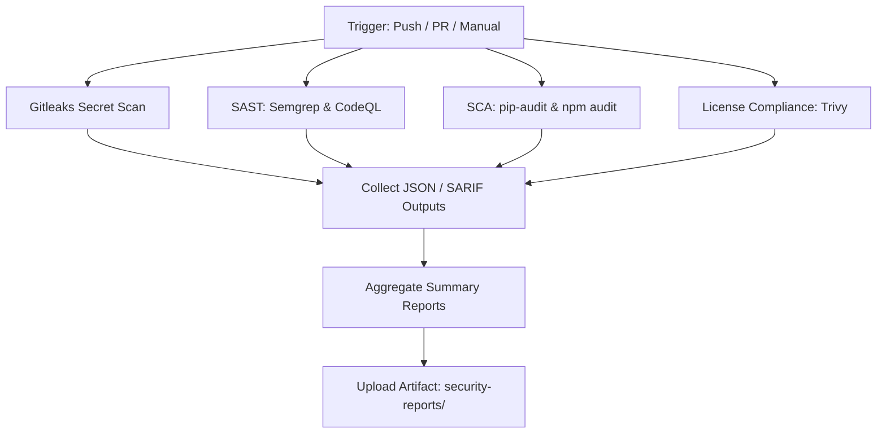

# OrbitX DevSecOps Scanning Pipeline Documentation

This directory contains configuration, local execution runners, and generated execution summaries for the OrbitX Security and Quality Automation Pipeline.

---

## 1. Pipeline Overview

The scanning pipeline is executed automatically on:
- All branch **push** events.
- **Pull Requests** targeting `main`, `master`, and `develop`.
- Manual **workflow_dispatch** triggers.

It integrates parallel scanner steps to minimize runtime, aggregate findings, and upload a unified `orbitx-security-reports` artifact to GitHub Actions.



---

## 2. Integrated Security Tools

| Tool | Focus Area | Report Format | Purpose |
|---|---|---|---|
| **Semgrep** | Static Application Security Testing (SAST) | `semgrep.sarif` | Flags code style warnings, OWASP Top 10 vulnerabilities, and performance patterns. |
| **CodeQL** | Deep Code Semantics SAST | `codeql.sarif` | Inspects data flow and structural patterns for deep injection vulnerabilities. |
| **Gitleaks** | Secret Scanning | `gitleaks-report.json` | Scans git history and workspace files for exposed keys, passwords, and private tokens. |
| **Trivy** | Software Composition Analysis (SCA) & Config | `trivy-report.json` | Audits system file layouts, configuration flags, and platform dependencies. |
| **pip-audit / Safety** | Python Dependencies SCA | `dependency-report.md` | Audits the FastAPI/Flask backend requirements for known package CVEs. |
| **npm audit** | Node.js Packages SCA | `dependency-report.md` | Scans React (`orbitx-web`) and React Native modules for vulnerable packages. |

---

## 3. Local Execution Guide

To verify code security locally before committing/pushing, use the provided helper scripts:

### For Linux & macOS (Bash)
1. Ensure the script is executable:
   ```bash
   chmod +x scripts/run_security_scans.sh
   ```
2. Execute the script:
   ```bash
   ./scripts/run_security_scans.sh
   ```

### For Windows (PowerShell)
1. Open PowerShell and navigate to the project root directory.
2. Execute the script:
   ```powershell
   .\scripts\run_security_scans.ps1
   ```

> [!TIP]
> If local binaries are not installed, both scripts will automatically attempt to run scans via **Docker** containers if Docker is active on your host system.

---

## 4. Report Interpretation & Remediation

### SARIF Files (`.sarif`)
- **What they are**: Static Analysis Results Interchange Format. Used by GitHub to display security alerts directly under the **Security > Code scanning** tab.
- **How to read them**: Import them into compatible IDE extensions (e.g., Sarif Viewer for VS Code) or view findings within the summary report.

### JSON Reports (`.json`)
- **Gitleaks (`gitleaks-report.json`)**: Contains details on exposed secrets (file path, line number, leak commit).
  - *Remediation*: If a leak is detected, revoke the credentials immediately and use `git-filter-repo` to scrub history.
- **Trivy (`trivy-report.json`)**: Contains detailed list of dependency CVEs, description, and patches.
  - *Remediation*: Locate the package in `package.json` or `requirements.txt` and bump to the recommended version.

### Markdown Summaries (`summary.md` & `dependency-report.md`)
- Review these for a quick, readable scorecard showing exact counts and next steps.
